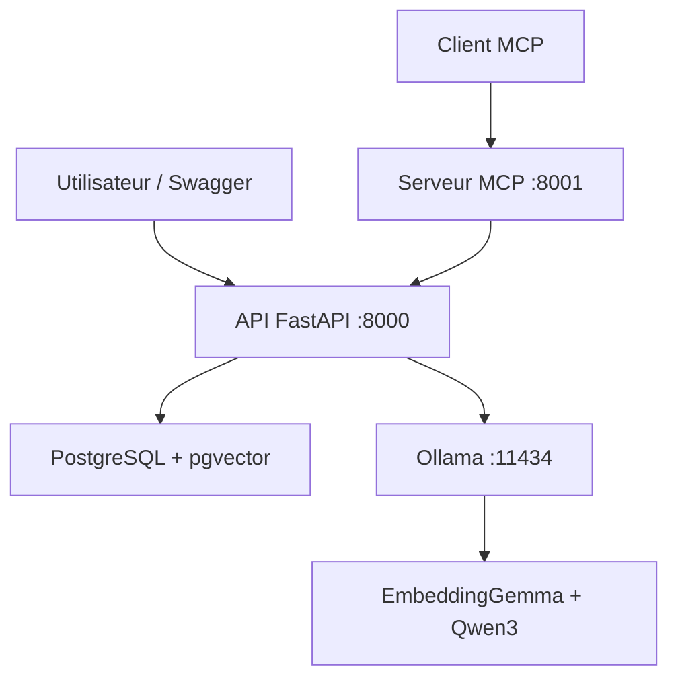

# QualityPilot AI

Assistant documentaire local basé sur une architecture RAG, conçu pour interroger des procédures qualité fournisseur en langage naturel et produire des réponses sourcées.

Le projet utilise des modèles exécutés localement avec Ollama, une base PostgreSQL enrichie par pgvector, une API FastAPI et un serveur MCP exposant les fonctionnalités du RAG sous forme d’outils standardisés.

> Statut : MVP fonctionnel et démontrable.

## Fonctionnalités

- Ingestion de documents texte
- Découpage automatique en chunks avec chevauchement
- Génération d’embeddings de 768 dimensions
- Stockage des vecteurs dans PostgreSQL avec pgvector
- Index vectoriel HNSW utilisant la distance cosinus
- Recherche sémantique des passages pertinents
- Génération locale de réponses avec Qwen3
- Réponses accompagnées des passages sources
- Refus des questions dont la réponse n’est pas présente
- API REST documentée automatiquement avec FastAPI
- Serveur MCP utilisant le transport Streamable HTTP
- Exécution des modèles sur GPU NVIDIA
- Déploiement multi-conteneurs avec Docker Compose

## Architecture



Le serveur MCP agit comme un adaptateur. Il ne duplique pas la logique du RAG : il appelle les routes de l’API FastAPI.

## Pipeline RAG

1. Un document texte est envoyé à l’API.
2. Le texte est découpé en chunks qui se chevauchent.
3. EmbeddingGemma transforme chaque chunk en vecteur.
4. Les chunks et leurs vecteurs sont enregistrés dans PostgreSQL.
5. La question de l’utilisateur est transformée en vecteur.
6. pgvector compare le vecteur de la question aux vecteurs stockés.
7. Les passages les plus similaires sont récupérés.
8. Ces passages sont ajoutés au contexte envoyé à Qwen3.
9. Qwen3 génère une réponse en citant les sources utilisées.

Le score retourné est un score de similarité cosinus, pas une probabilité.

## Technologies

| Composant | Technologie |
|---|---|
| API | Python 3.12, FastAPI, Uvicorn |
| LLM | Qwen3 4B |
| Embeddings | EmbeddingGemma |
| Base de données | PostgreSQL 17 |
| Recherche vectorielle | pgvector, index HNSW |
| Exécution locale des modèles | Ollama |
| Protocole d’outils IA | MCP Python SDK |
| Conteneurisation | Docker, Docker Compose |
| Versionnement | Git, GitHub, Pull Requests |
| Accélération | GPU NVIDIA via Docker Desktop et WSL2 |

## Structure du projet

```text
qualitypilot-ai/
├── app/
│   ├── chunking.py
│   ├── config.py
│   ├── database.py
│   ├── embeddings.py
│   ├── llm.py
│   ├── main.py
│   ├── schema.sql
│   └── schemas.py
├── mcp_server/
│   ├── __init__.py
│   ├── server.py
│   └── smoke_test.py
├── data/
│   └── documents/
│       └── procedure_qualite_fournisseur.txt
├── scripts/
│   └── init-db.sql
├── Dockerfile
├── Dockerfile.mcp
├── compose.yaml
├── requirements.txt
├── mcp-requirements.txt
├── .env.example
└── README.md
```

## Prérequis

La configuration utilisée pour développer le projet comprend :

- Windows avec WSL2
- Docker Desktop
- Docker Compose
- Git
- GPU NVIDIA compatible avec Docker
- Au moins 8 Go de mémoire GPU recommandés

Le projet peut être adapté pour fonctionner uniquement sur CPU, avec des performances plus faibles.

## Installation

### 1. Cloner le dépôt

```powershell
git clone https://github.com/benjik50/qualitypilot-ai.git
cd qualitypilot-ai
```

### 2. Créer la configuration locale

```powershell
Copy-Item .env.example .env
```

Ouvrir ensuite `.env` et vérifier les valeurs.

Le fichier `.env` contient la configuration locale et ne doit pas être ajouté à Git.

### 3. Construire et démarrer les services

```powershell
docker compose up -d --build
```

### 4. Télécharger les modèles Ollama

```powershell
docker compose exec ollama ollama pull embeddinggemma
docker compose exec ollama ollama pull qwen3:4b
```

### 5. Vérifier les conteneurs

```powershell
docker compose ps
```

Les services suivants doivent être disponibles :

- `qualitypilot-db`
- `qualitypilot-ollama`
- `qualitypilot-api`
- `qualitypilot-mcp`

## Utilisation de l’API

La documentation Swagger est disponible à l’adresse :

```text
http://localhost:8000/docs
```

Sous Windows :

```powershell
Start-Process "http://localhost:8000/docs"
```

### Ingestion du document de démonstration

```powershell
$documentPath = ".\data\documents\procedure_qualite_fournisseur.txt"

$resolvedPath = (Resolve-Path $documentPath).Path

$documentText = [System.IO.File]::ReadAllText(
    $resolvedPath,
    [System.Text.Encoding]::UTF8
)

$ingestObject = [ordered]@{
    document_name = "procedure_qualite_fournisseur.txt"
    text = $documentText
}

$ingestJson = $ingestObject | ConvertTo-Json -Compress

$ingestBody = [System.Text.Encoding]::UTF8.GetBytes(
    $ingestJson
)

$ingestResponse = Invoke-RestMethod `
    -Uri "http://localhost:8000/documents/ingest" `
    -Method Post `
    -ContentType "application/json; charset=utf-8" `
    -Body $ingestBody

$ingestResponse | ConvertTo-Json
```

### Poser une question

Exemple de requête pour `POST /ask` :

```json
{
  "question": "Sous quel délai un fournisseur doit-il accuser réception d'une anomalie critique ?",
  "top_k": 3
}
```

Exemple de réponse :

```json
{
  "answer": "Un fournisseur doit accuser réception d'une anomalie critique sous vingt-quatre heures [Source 1].",
  "chat_model": "qwen3:4b"
}
```

## Routes principales

| Méthode | Route | Fonction |
|---|---|---|
| GET | `/health` | Vérifier l’état de l’API |
| GET | `/documents` | Lister les documents indexés |
| POST | `/documents/ingest` | Découper et indexer un document |
| POST | `/ask` | Rechercher les passages et générer une réponse |
| GET | `:8001/health` | Vérifier l’état du serveur MCP |
| MCP | `:8001/mcp` | Endpoint Streamable HTTP MCP |

## Serveur MCP

Le serveur MCP expose deux outils.

### `list_documents`

Liste les documents actuellement indexés dans QualityPilot AI.

### `ask_qualitypilot`

Pose une question au pipeline RAG et retourne :

- la réponse générée ;
- le modèle utilisé ;
- les passages sources ;
- les indices des chunks ;
- les scores de similarité.

### Tester le serveur MCP

```powershell
docker compose exec mcp python -m mcp_server.smoke_test
```

Le client de test :

1. se connecte à `http://localhost:8001/mcp` ;
2. découvre automatiquement les outils ;
3. appelle `list_documents` ;
4. appelle `ask_qualitypilot` ;
5. affiche la réponse RAG et les sources.

## Validation réalisée

Les vérifications suivantes ont été effectuées :

- Conteneur PostgreSQL healthy
- Extension pgvector disponible
- Vecteurs de 768 dimensions enregistrés
- Ingestion idempotente : un document et quatre chunks
- Recherche sémantique cohérente
- Réponse correcte sur le délai de vingt-quatre heures
- Réponse correcte sur les cinq pourquoi et Ishikawa
- Refus d’inventer un chiffre d’affaires absent
- Réponses accompagnées de sources
- EmbeddingGemma exécuté à 100 % sur GPU
- Qwen3 exécuté à 100 % sur GPU
- Serveur MCP healthy
- Découverte automatique des outils MCP
- Appel du pipeline RAG via MCP

## Concepts mis en œuvre

### RAG

Le Retrieval-Augmented Generation enrichit le contexte du LLM avec des passages récupérés dans une base documentaire.

### Embeddings

Les embeddings représentent les textes sous forme de vecteurs numériques. Des textes sémantiquement proches possèdent généralement des vecteurs proches.

### LLM

Qwen3 génère la réponse finale à partir de la question et des passages sélectionnés. Le LLM ne consulte pas directement PostgreSQL.

### MCP

Le Model Context Protocol standardise la découverte et l’appel d’outils par les applications d’intelligence artificielle.

### Machine Learning et Deep Learning

Qwen3 et EmbeddingGemma sont des modèles de Deep Learning préentraînés. Le projet réalise de l’inférence et non de l’entraînement.

## Limites du MVP

- Ingestion limitée aux fichiers texte
- Document de démonstration entièrement fictif
- Pas d’authentification
- Pas d’interface graphique
- Pas d’évaluation sur un grand corpus
- Pas d’agent autonome ReAct
- Pas de traitement d’image avec un VLM

## Améliorations possibles

- Ajouter l’import de fichiers PDF
- Ajouter une interface Streamlit ou React
- Ajouter des tests automatisés
- Ajouter une évaluation RAG avec un jeu de questions
- Ajouter une authentification
- Ajouter un agent ReAct utilisant les outils MCP
- Ajouter un VLM pour analyser des photographies de défauts
- Ajouter une stratégie de reranking
- Déployer le projet sur une infrastructure cloud

## Workflow Git

Le projet a été développé avec un workflow par fonctionnalités :

```text
main
├── feature/docker-infra
├── feature/api-foundation
├── feature/rag-ingestion
├── feature/rag-query
└── feature/mcp-server
```

Chaque fonctionnalité a été développée dans une branche séparée, validée, poussée sur GitHub puis fusionnée dans `main` par Pull Request.

## Données

Le document qualité fournisseur présent dans ce dépôt est entièrement synthétique. Il ne contient aucune donnée confidentielle provenant d’une entreprise réelle.

## Auteur

Benjamin Malhiaire

Projet personnel d’ingénierie IA.
